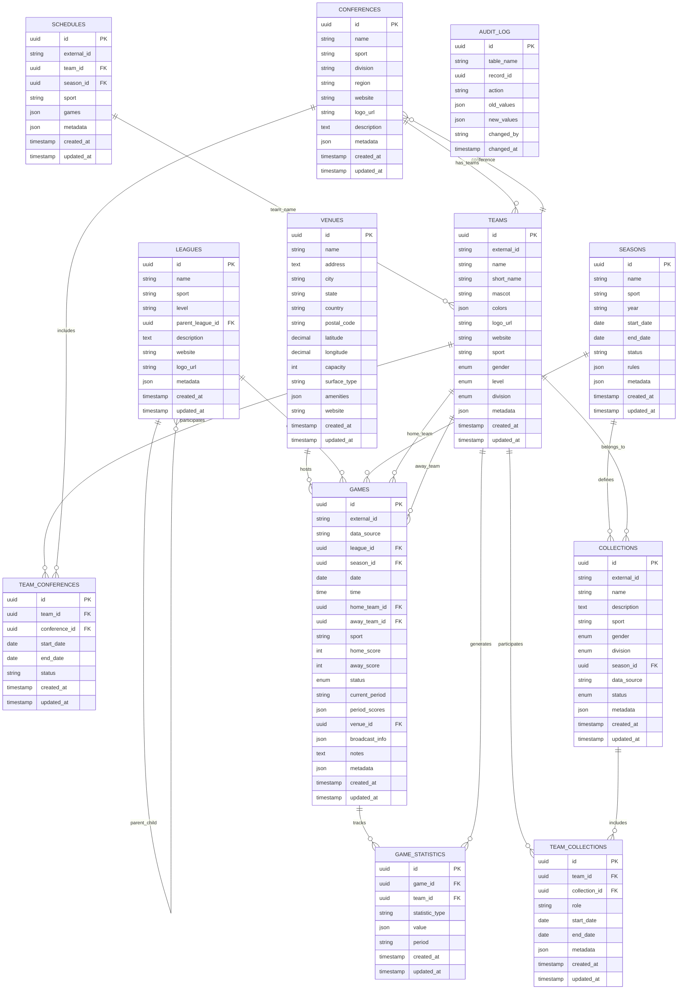

# Scoreboard API

A modern, scalable Express.js API for the Scoreboard application, built with SOLID principles and design patterns.

## 🏗️ Architecture

This API follows a clean, layered architecture:

- **Controllers**: Handle HTTP requests and responses
- **Services**: Implement business logic
- **Repositories**: Abstract data access
- **Database Adapters**: Provide database-specific implementations
- **Routes**: Define API endpoints

### Design Patterns Used

- **Repository Pattern**: Abstracts data access logic
- **Strategy Pattern**: Allows easy switching between database backends
- **Factory Pattern**: Creates appropriate database adapters
- **Service Layer Pattern**: Separates business logic from controllers
- **MVC Pattern**: Organizes code into Model-View-Controller layers

### Entity Relationship Diagram

The API manages the following enhanced entities and their relationships. This diagram shows the improved database schema with proper normalization, UUID primary keys, and optimized relationships:

**Note**: The Mermaid diagram below will render in GitHub and other Markdown viewers that support Mermaid syntax.



#### Entity Descriptions

**VENUES** - Physical locations where games are played
- **Primary Key**: `id` (UUID)
- **Features**: Geospatial coordinates, capacity, surface type, amenities
- **Benefits**: Eliminates venue duplication, enables location-based queries

**LEAGUES** - Hierarchical organization of sports competitions
- **Primary Key**: `id` (UUID)
- **Structure**: Supports parent-child relationships (e.g., NCAA → Division I → Conference)
- **Metadata**: Flexible JSON storage for league-specific information

**CONFERENCES** - Athletic conferences that organize teams
- **Primary Key**: `id` (UUID)
- **Attributes**: Sport, division, region, website, logo, description
- **Relationships**: Connected to teams via junction table

**SEASONS** - Time-bound periods for sports competitions
- **Primary Key**: `id` (UUID)
- **Features**: Start/end dates, status, rules, metadata
- **Purpose**: Better organization of games and schedules across time

**TEAMS** - Represents sports teams with enhanced categorization
- **Primary Key**: `id` (UUID)
- **Attributes**: Sport, gender (ENUM), level (ENUM), division (ENUM)
- **Relationships**: Connected to conferences and collections via junction tables

**TEAM_CONFERENCES** - Junction table for team-conference relationships
- **Purpose**: Many-to-many relationship with temporal tracking
- **Features**: Start/end dates, status, supports historical data

**COLLECTIONS** - Groupings of related data or events
- **Primary Key**: `id` (UUID)
- **Enhancements**: Proper foreign keys to seasons, ENUM constraints
- **Metadata**: Flexible JSON storage for collection-specific data

**TEAM_COLLECTIONS** - Junction table for team-collection relationships
- **Purpose**: Many-to-many relationship with role-based participation
- **Features**: Role assignment, temporal tracking, metadata

**GAMES** - Core entity representing individual sporting events
- **Primary Key**: `id` (UUID)
- **Enhancements**: Proper foreign keys, ENUM status, normalized venue data
- **Constraints**: CHECK constraint prevents self-matches

**SCHEDULES** - Team schedules for specific seasons
- **Primary Key**: `id` (UUID)
- **Improvements**: Proper foreign keys to teams and seasons
- **Metadata**: Flexible JSON storage for schedule-specific data

**GAME_STATISTICS** - Detailed statistics for games
- **Purpose**: Store comprehensive game statistics by team and period
- **Structure**: Flexible JSON values for different statistic types

**AUDIT_LOG** - Comprehensive change tracking
- **Purpose**: Track all INSERT, UPDATE, DELETE operations
- **Features**: Before/after values, user attribution, timestamp tracking

#### Key Relationships

1. **Games ↔ Teams**: Each game has exactly one home team and one away team
2. **Teams ↔ Conferences**: Teams belong to conferences for organizational purposes
3. **Teams ↔ Collections**: Teams can be part of multiple collections (tournaments, seasons)
4. **Schedules ↔ Teams**: Each schedule belongs to a specific team
5. **Games ↔ Collections**: Games can be organized into collections for analysis

#### Alternative Text Representation

If the Mermaid diagram doesn't render, here's a text-based representation:

```
GAMES (game_id*) ←→ TEAMS (name*)
├── home_team → TEAMS.name
├── away_team → TEAMS.name
└── conference → CONFERENCES.name (via TEAMS)

TEAMS (name*) ←→ CONFERENCES (name*)
├── conference → CONFERENCES.name
└── sport, division, mascot, colors, logo_url, website

CONFERENCES (name*) ←→ TEAMS
├── sport, division, region, website
└── contains multiple teams

COLLECTIONS (collection_id*) ←→ TEAMS
├── name, description, sport, data_source
├── metadata (JSON)
└── can contain multiple teams

SCHEDULES (schedule_id*) ←→ TEAMS
├── team_name → TEAMS.name
├── season, sport
└── games (JSON array)
```

*PK = Primary Key, FK = Foreign Key

### Code Quality Standards

The project maintains high code quality through automated tools and best practices:

#### Cyclomatic Complexity

- **Maximum Threshold**: 10 (enforced by ESLint)
- **Purpose**: Ensures methods remain maintainable and testable
- **Benefits**: 
  - Easier to understand and debug
  - Simpler to unit test
  - Reduced cognitive load for developers
  - Better code maintainability

#### Code Quality Tools

- **ESLint**: Code linting and style enforcement
- **Prettier**: Code formatting (via ESLint rules)
- **Jest**: Testing framework with coverage reporting
- **Testcontainers**: Integration testing with real databases

#### Quality Gates

- ✅ **Linting**: All ESLint rules must pass
- ✅ **Complexity**: Methods under 10 cyclomatic complexity
- ✅ **Coverage**: Minimum 80% test coverage
- ✅ **Tests**: All tests must pass
- ✅ **Security**: No known vulnerabilities

#### Recent Quality Improvements

The project recently underwent a comprehensive refactoring to improve code quality and maintainability:

##### Cyclomatic Complexity Refactoring

**Methods Refactored:**
- **`validateConfig`** (was 14, now < 10): Split into focused validation methods
- **`sanitizeFilters`** (was 16, now < 10): Extracted string and status validation helpers
- **`sanitizeOptions`** (was 11, now < 10): Separated into limit, offset, sort, and order methods
- **`findAll`** (was 14, now < 10): Broke down into filter-specific builder methods
- **`create`** (was 15, now < 10): Split parameter building into focused functions
- **`_buildGameParams`** (was 13, now < 10): Composed from smaller, focused helpers

**Refactoring Benefits:**
- **Maintainability**: Each method has a single responsibility
- **Readability**: Logic is easier to understand and follow
- **Testability**: Smaller methods are easier to unit test
- **Reusability**: Helper methods can be reused elsewhere
- **Performance**: Reduced nested conditionals and early returns

**Design Patterns Applied:**
- **Extract Method**: Breaking complex methods into smaller ones
- **Template Method**: Common patterns in filter building
- **Strategy**: Different validation strategies for different data types
- **Composition**: Building complex objects from simpler parts

## 🚀 Features

- **Multi-Database Support**: SQLite, PostgreSQL, and DynamoDB
- **RESTful API**: Follows REST conventions
- **Authentication Ready**: JWT-based authentication support
- **Rate Limiting**: Built-in request throttling
- **Health Checks**: Comprehensive health monitoring
- **CORS Support**: Configurable cross-origin requests
- **Security**: Helmet.js security headers
- **Logging**: Structured logging with Winston
- **Validation**: Input validation with Joi
- **Docker Support**: Containerized deployment
- **Testing**: Comprehensive testing with Jest and Testcontainers
- **CI/CD**: Automated workflows with GitHub Actions

## 📋 Prerequisites

- Node.js 18+ 
- npm or yarn
- Docker (for containerized deployment and integration testing)

## 🛠️ Installation

1. **Clone the repository**
   ```bash
   git clone <repository-url>
   cd scoreboard-api
   ```

2. **Install dependencies**
   ```bash
   npm install
   ```

3. **Configure environment**
   ```bash
   cp env.example .env
   # Edit .env with your configuration
   ```

4. **Start development server**
   ```bash
   npm run dev
   ```

## ⚙️ Configuration

### Environment Variables

| Variable | Description | Default |
|----------|-------------|---------|
| `NODE_ENV` | Environment (development/production) | `development` |
| `PORT` | Server port | `3000` |
| `DATABASE_TYPE` | Database backend (sqlite/postgres/dynamodb) | `sqlite` |
| `SQLITE_DATABASE_PATH` | SQLite database file path | `./data/scoreboard.db` |
| `POSTGRES_HOST` | PostgreSQL host | `localhost` |
| `POSTGRES_PORT` | PostgreSQL port | `5432` |
| `POSTGRES_DATABASE` | PostgreSQL database name | `scoreboard` |
| `DYNAMODB_REGION` | DynamoDB region | `us-east-1` |

### Database Configuration

The API supports multiple database backends:

#### SQLite (Default)
- File-based database
- Perfect for development and testing
- No additional setup required

#### PostgreSQL
- Robust relational database
- Requires PostgreSQL server
- Uses connection pooling

#### DynamoDB
- AWS NoSQL database
- Supports local development with DynamoDB Local
- Scalable and managed

## 🧪 Testing

The API includes a comprehensive testing setup with both unit and integration tests using Jest and Testcontainers.

### Test Types

#### Unit Tests
- **Location**: `tests/unit/`
- **Purpose**: Test business logic without external dependencies
- **Speed**: Fast execution (< 5 seconds)
- **Dependencies**: Mocked database and external services
- **Coverage**: Business logic, validation, and utility functions

#### Integration Tests
- **Location**: `tests/integration/`
- **Purpose**: Test API endpoints with real databases
- **Speed**: Slower execution (30-60 seconds)
- **Dependencies**: Real database instances via Testcontainers
- **Coverage**: End-to-end API functionality, database operations

### Test Setup

#### Jest Configuration
- **ES Modules Support**: Full ES6+ module support
- **Coverage Thresholds**: 80% minimum coverage required
- **Separate Configs**: Different timeouts and setups for unit vs integration tests
- **Mock Management**: Automatic cleanup between tests

#### Testcontainers Integration
- **PostgreSQL**: Spins up real PostgreSQL containers for testing
- **SQLite**: Uses local file-based database for fast testing
- **Automatic Cleanup**: Containers are automatically started/stopped
- **Isolated Testing**: Each test gets a clean database state

### Running Tests

```bash
# Run all tests
npm test

# Run only unit tests (fast)
npm run test:unit

# Run only integration tests (slower, requires Docker)
npm run test:integration

# Run tests in watch mode
npm run test:watch

# Run tests with coverage report
npm run test:coverage

# Run integration tests in watch mode
npm run test:integration:watch
```

### Test Environment Variables

```bash
# Set test database type
TEST_DATABASE=sqlite        # Use SQLite (default, fastest)
TEST_DATABASE=postgres      # Use PostgreSQL container (slower, more realistic)

# Set test environment
NODE_ENV=test              # Automatically set by test scripts
```

### Test Database Options

#### SQLite (Default)
- **Pros**: Fast, no Docker required, file-based
- **Cons**: Less realistic, different SQL dialect
- **Use Case**: Development, CI/CD, fast feedback

#### PostgreSQL (Testcontainers)
- **Pros**: Real database, production-like behavior, full SQL support
- **Cons**: Slower startup, requires Docker
- **Use Case**: Integration testing, production validation

### Test Structure

```
tests/
├── setup.js                    # Global test configuration
├── setup-unit.js              # Unit test setup (mocks)
├── setup-integration.js       # Integration test setup (Testcontainers)
├── unit/                      # Unit tests
│   ├── services/             # Service layer tests
│   ├── controllers/          # Controller tests
│   └── utils/                # Utility function tests
└── integration/               # Integration tests
    ├── api/                  # API endpoint tests
    ├── database/             # Database operation tests
    └── end-to-end/           # Full workflow tests
```

### Writing Tests

#### Unit Test Example
```javascript
import { GamesService } from '../../../src/services/games-service.js';

describe('GamesService', () => {
  let gamesService;
  let mockDatabaseAdapter;

  beforeEach(() => {
    mockDatabaseAdapter = global.unitTestUtils.createMockDatabaseAdapter();
    gamesService = new GamesService(mockDatabaseAdapter);
  });

  it('should sanitize valid filters', () => {
    const filters = { sport: ' SOCCER ' };
    const result = gamesService.sanitizeFilters(filters);
    expect(result.sport).toBe('soccer');
  });
});
```

#### Integration Test Example
```javascript
import request from 'supertest';
import { createApp } from '../../../src/app.js';
import { DatabaseFactory } from '../../../src/database/database-factory.js';

describe('Games API Integration', () => {
  let app;
  let databaseAdapter;

  beforeAll(async () => {
    // Get test database config
    const testConfig = global.integrationTestUtils.getTestDatabaseConfig('sqlite');
    
    // Create real database adapter
    databaseAdapter = DatabaseFactory.createAdapter(testConfig.config);
    await databaseAdapter.connect();
    
    // Create Express app
    app = createApp(databaseAdapter);
  });

  it('should create and retrieve a game', async () => {
    const gameData = global.testUtils.generateTestGame();
    
    // Create game
    const createResponse = await request(app)
      .post('/api/v1/games')
      .send(gameData);
    
    expect(createResponse.status).toBe(201);
    
    // Retrieve game
    const getResponse = await request(app)
      .get(`/api/v1/games/${gameData.game_id}`);
    
    expect(getResponse.status).toBe(200);
    expect(getResponse.body.data.game_id).toBe(gameData.game_id);
  });
});
```

### Test Utilities

#### Global Test Utils
- `testUtils.generateTestGame()`: Generate random game data
- `testUtils.generateTestTeam()`: Generate random team data
- `testUtils.randomString()`: Generate random strings
- `testUtils.randomDate()`: Generate random dates

#### Unit Test Utils
- `unitTestUtils.createMockDatabaseAdapter()`: Create mock database
- `unitTestUtils.createMockRequest()`: Create mock HTTP request
- `unitTestUtils.createMockResponse()`: Create mock HTTP response

#### Integration Test Utils
- `integrationTestUtils.setupPostgresContainer()`: Start PostgreSQL container
- `integrationTestUtils.getTestDatabaseConfig()`: Get database configuration
- `integrationTestUtils.cleanupPostgresContainer()`: Stop PostgreSQL container

### Test Coverage

The testing setup enforces 80% minimum coverage across:
- **Branches**: All code paths are tested
- **Functions**: All functions have tests
- **Lines**: All lines of code are executed
- **Statements**: All statements are covered

### Continuous Integration

The test setup is designed for CI/CD pipelines:
- **Fast Unit Tests**: Quick feedback on code changes
- **Comprehensive Integration Tests**: Validate production behavior
- **Coverage Reports**: Track test quality over time
- **Docker Support**: Consistent testing environment

## 📝 Code Quality

```bash
# Lint code
npm run lint

# Fix linting issues
npm run lint:fix
```

## 🔧 Development

### Project Structure
```
src/
├── config/           # Configuration files
├── controllers/      # HTTP request handlers
├── database/         # Database abstraction layer
│   ├── adapters/    # Database implementations
│   └── repositories/ # Data access layer
├── middleware/       # Express middleware
├── models/          # Data models
├── routes/          # API endpoint definitions
├── services/        # Business logic
├── utils/           # Utility functions
├── validators/      # Input validation
├── app.js           # Express application setup
└── index.js         # Application entry point
```

### Adding New Features

1. **Create Repository**: Extend `BaseRepository`
2. **Create Service**: Implement business logic
3. **Create Controller**: Handle HTTP requests
4. **Create Routes**: Define API endpoints
5. **Add Validation**: Create validation schemas
6. **Write Tests**: Ensure code coverage

### Database Migration

When adding new database backends:

1. Create adapter extending `BaseDatabaseAdapter`
2. Update `DatabaseFactory`
3. Add configuration options
4. Update Docker Compose configuration

## 🚀 CI/CD & Deployment

### GitHub Actions Workflows

The project includes comprehensive CI/CD workflows that automatically validate code quality and run tests:

#### Main CI Workflow (`ci.yml`)
- **Triggers**: Push to main/develop, PRs, manual dispatch
- **Validation**: Linting, unit tests, integration tests, security audit
- **Matrix Testing**: Node.js 18/20, multiple OS, multiple databases
- **Quality Gates**: 80% coverage, complexity < 10, no security issues
- **Docker**: Build and test container images
- **Performance**: API response time validation

#### Quick PR Check (`pr-check.yml`)
- **Purpose**: Fast validation for pull requests
- **Timeout**: 10 minutes maximum
- **Focus**: Essential checks only (linting, unit tests, coverage)
- **Benefits**: Quick feedback, prevents obvious issues

#### Security Workflow (`security.yml`)
- **Schedule**: Daily at 2 AM UTC
- **Features**: Dependency updates, security scanning, CodeQL analysis
- **Container Security**: Trivy vulnerability scanner
- **Automation**: Issue creation for security updates

#### Workflow Benefits

- **Fast Feedback Loop**: Quick PR validation → comprehensive testing
- **Progressive Validation**: Basic → integration → security → performance
- **Fail-Fast Approach**: Stop on first failure to save resources
- **Matrix Testing**: Multiple environments and configurations
- **Automated Reporting**: PR comments and coverage reports

### Quality Gates

Your code must pass all of these to be considered valid:
- ✅ **All tests pass** (unit + integration)
- ✅ **80% test coverage** minimum
- ✅ **No security vulnerabilities**
- ✅ **Linting passes** without errors
- ✅ **Docker builds** successfully
- ✅ **API endpoints** respond correctly
- ✅ **Performance** within acceptable limits
- ✅ **Complexity** under 10 threshold

## 🚀 Deployment

### Production Considerations

- Set `NODE_ENV=production`
- Configure proper CORS origins
- Set secure JWT secrets
- Enable rate limiting
- Configure logging
- Set up monitoring and health checks

### Environment-Specific Configs

- **Development**: SQLite, verbose logging, CORS enabled
- **Staging**: PostgreSQL, moderate logging, CORS restricted
- **Production**: PostgreSQL/DynamoDB, minimal logging, strict CORS

## 📊 Monitoring

### Health Checks
- `/health/liveness` - Kubernetes liveness probe
- `/health/readiness` - Kubernetes readiness probe
- `/health/detailed` - Comprehensive system status

### Metrics
- Request duration logging
- Database connection status
- Memory usage monitoring
- Error rate tracking

## 📖 **Documentation**

For detailed information about the database design and improvements:

- **[Entity Design Improvements](docs/entity-improvements.md)** - Comprehensive overview of entity design enhancements
- **[3NF Database Schema](docs/3nf-improvements.md)** - Detailed explanation of Third Normal Form compliance

## 🤝 Contributing

1. Follow the established architecture patterns
2. Write tests for new features (maintain 80% coverage)
3. Maintain code quality standards
4. Update documentation
5. Follow commit message conventions

### Conventional Commits

This project follows the [Angular Conventional Commits](https://www.conventionalcommits.org/) specification for commit messages. This ensures consistent commit history and enables automated tools for versioning and changelog generation.

#### Commit Message Format

```
type(scope): description

[optional body]

[optional footer(s)]
```

#### Commit Types

- **`feat:`** - New features
- **`fix:`** - Bug fixes
- **`docs:`** - Documentation changes
- **`style:`** - Code style changes (formatting, etc.)
- **`refactor:`** - Code refactoring
- **`test:`** - Adding or updating tests
- **`chore:`** - Maintenance tasks
- **`perf:`** - Performance improvements
- **`ci:`** - CI/CD changes
- **`build:`** - Build system changes

#### Examples

```bash
# Feature
git commit -m "feat(auth): add JWT authentication middleware"

# Bug fix
git commit -m "fix(database): resolve connection timeout issues"

# Refactoring
git commit -m "refactor(services): reduce method complexity"

# Documentation
git commit -m "docs(api): update endpoint documentation"

# Breaking change
git commit -m "feat(api): change response format

BREAKING CHANGE: API responses now return data in 'result' field"
```

#### Benefits

- **Automated Versioning**: Semantic versioning based on commit types
- **Changelog Generation**: Automatic creation of detailed release notes
- **CI/CD Integration**: Trigger appropriate workflows based on commit type
- **Team Communication**: Clear understanding of what type of change was made
- **Release Management**: Easy identification of breaking changes

### Testing Guidelines

1. **Unit Tests**: Write for all business logic
2. **Integration Tests**: Write for all API endpoints
3. **Coverage**: Maintain 80% minimum coverage
4. **Test Data**: Use test utilities for consistent data
5. **Cleanup**: Ensure tests clean up after themselves

## 📄 License

This project is licensed under the ISC License.

## 🆘 Support

For issues or questions:
- Check the documentation
- Review the code examples
- Open an issue in the repository
- Contact the development team
